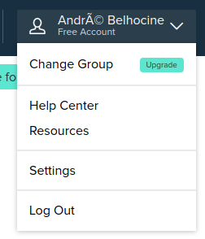
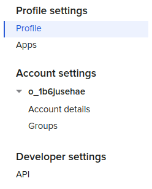
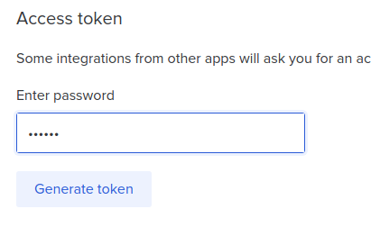

# Coding Challenge Submission

Hello to those viewing this repository. This repository is based off of the coding template provided by Tier Mobility and aims to solve the coding challenge specified below (see **Coding Challenge** below)

This code goes hand in hand with a django server developed for completing the challenge. Please start running the backend specified by the repository `https://github.com/mgomez05/TierMobilityCodingChallengeBackend` to make sure the frontend runs correctly.

# **Coding Challenge** 🦅

# What you have to do

_“As a user I want to shorten my long url and be able to copy it into clipboard to post it on a social platform (e.g. Twitter).”_

## Challenge

In this challenge, we’re asking you to create a user interface to shorten URLs so,

If you are a **front end developer**,  please use the [Bitly API](https://dev.bitly.com/api-reference#operation/createBitlink) for the backend part.
To get a token you can follow these steps:

Go to your user settings

Select API in the menu

After filling your user password you can request a token

In order to use the bitly API you need an `Authentication token`, which you will put in the environment variables (`.env`) of the project.

[Adding a custom environment variables](https://create-react-app.dev/docs/adding-custom-environment-variables/)

If you are a **full stack developer**, please tackle both backend and frontend part of the challenge, each of course only to the extent possible within the given time frame.

Bonus points:

-   `Validate user data`
-   `Create a test suite`
-   `Create and use reusable components`
-   `Create your own CSS theme (clean & responsive layout)`

Please do not spend more than **2 hours** on this, don’t worry if you don’t finish everything. Please send us a link to your project on GitHub. Good luck and have fun!

### Installation & setup

Run `yarn install` to install dependancies, then copy `.env.dist` to `.env`.

### Available Scripts

In the project directory, you can run:

#### `yarn start`

Runs the app in the development mode.
Open [http://localhost:3000](http://localhost:3000) to view it in the browser.

The page will reload if you make edits.
You will also see any lint errors in the console.

#### `yarn lint`

Check and fix based on linting rules
